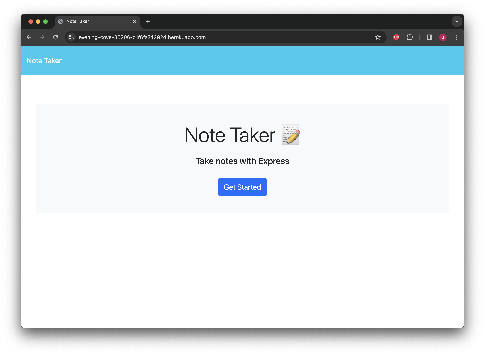
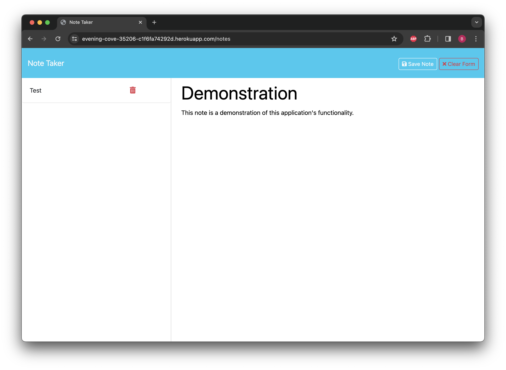
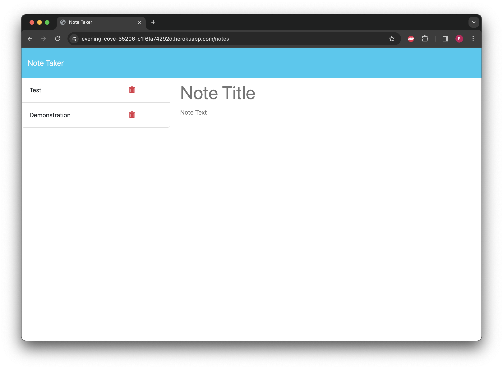

# note_taker

## Description
A website that allows a user to create, view, and delete notes.  The application uses a file writing system to record persistent data.

## Usage
On the homepage, press the "Get Started" button.  Write a note title and a note body.  WHen both fields are no longer empty, a "Save Note" button will appear.  To delete an existing note, click the garbage can icon next to the note.

## Link
[Link to deployed application.](https://evening-cove-35206-c1f6fa74292d.herokuapp.com/)

## Screenshots

## Work Cited
This applications helper functions are adapted from previous activities in the Uconn Coding Bootcamp syllabus.